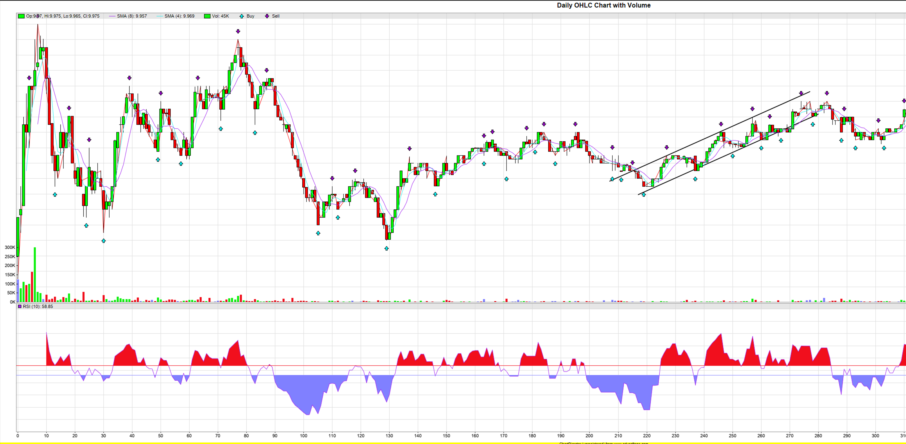

# **Financial Pattern Recognition**

## **Purpose:**

This project aims to identify common financial chart patterns through mathematical analysis. A general algorithm is first applied to identify local peaks/troughs, where then specialized algorithm will be applied to identify each shape such as an ascending channel.

## **Tech Stack:**

- C++
- ChartDirector
- yFinance & Python (data is retrived using yFinance - not included in this repo)

## **Example:**

Modify the code to select which chart algorithm recognition you want to run. In this the ascending channel has been selected with GOGL intraday minute bar data on Feb 2nd, 2022 (arbitrary date). Then run the code, and an ascending channel has been detected, it will draw the shape as seen below.

The sensitivity of the pattern recognition can be modified to adjust ones needs.

## **Future work:**

Athough basic features exists such as identifying ascending channels, this project is far from complete. Some planned future work include:

- Adding more patterns
- Allow custom time period
- Use machine learning to identify common trends given patterns
